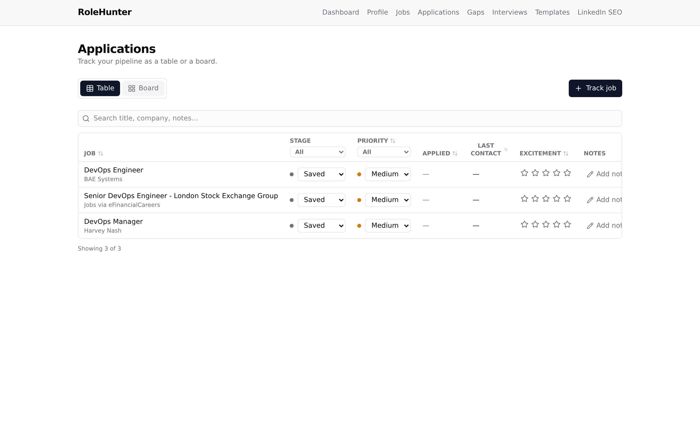
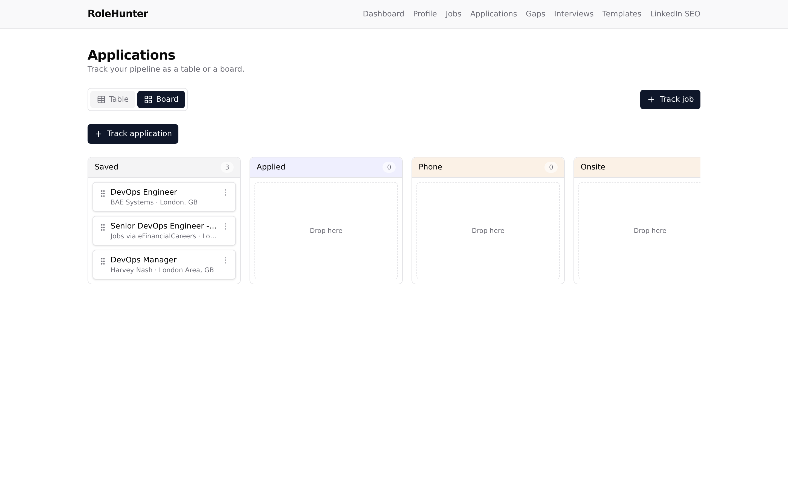
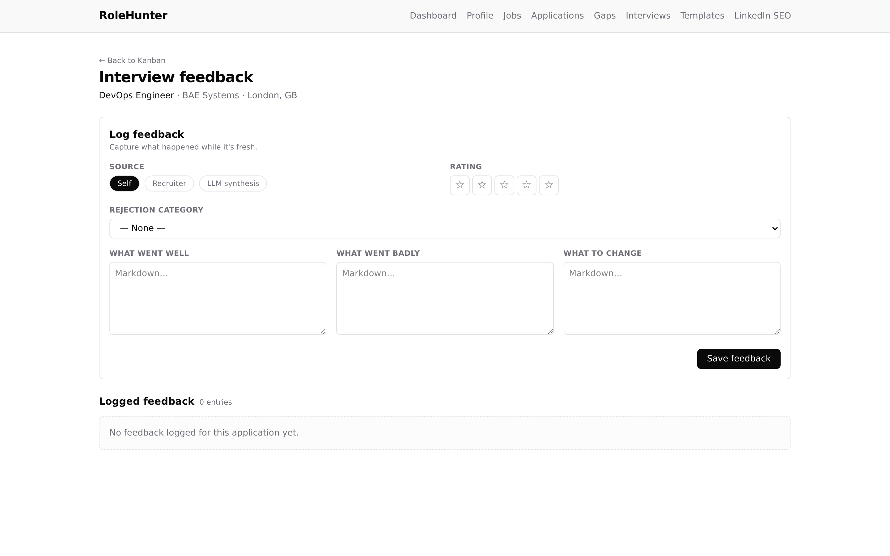
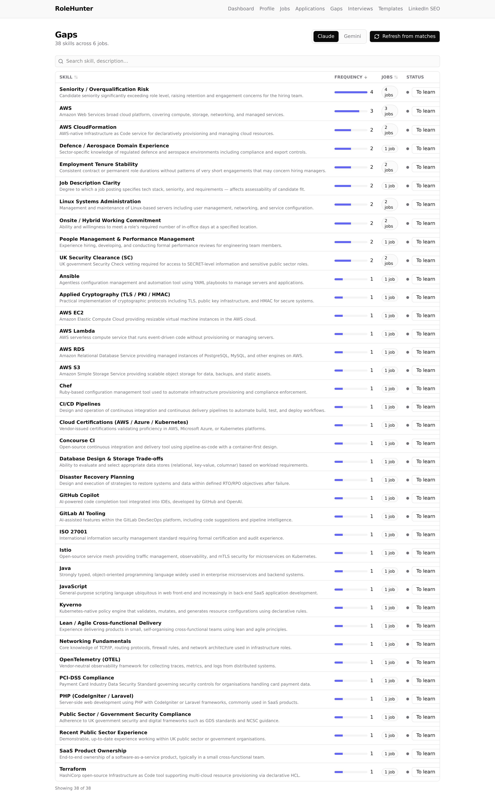
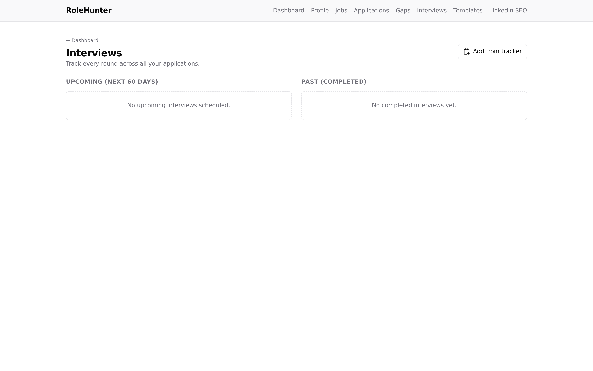
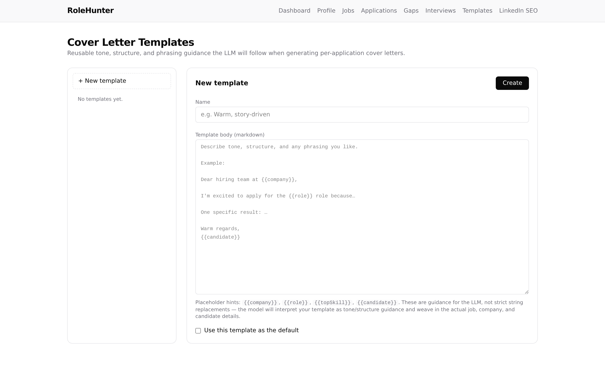
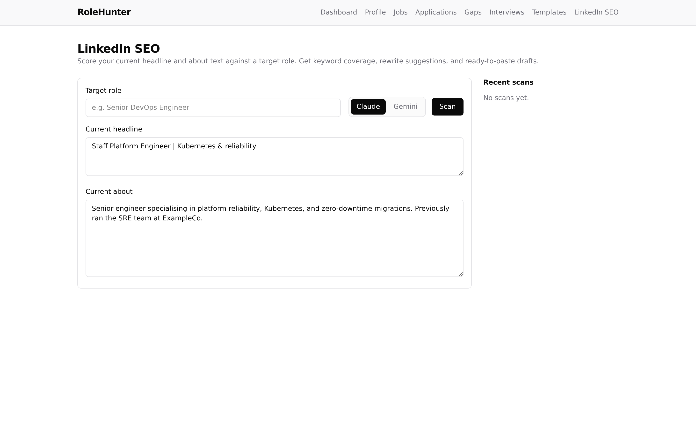

# Starting guide

One section per page. Tells you what's on it and what every button does.

## Dashboard — `/`

The landing page. Five metric tiles across the top:

- **Applications** — count of applications past the Saved stage.
- **Responses** — percentage that reached Phone, Onsite, Offer, or Rejected.
- **Reached interview** — percentage that reached Phone, Onsite, or Offer.
- **Offers** — percentage that reached Offer.
- **Avg match** — average score across all per-role match runs.

Four populated sections below the metrics:

- **Upcoming interviews (next 60 days)** — scheduled interviews only, sorted by date. Schedule ones from any job detail page.
- **Action queue** — thank-you-due, follow-up-due, stale applications. Click the action button on each card to execute in place.
- **Top scored roles** — one row per job, highest score first, deduped so you only see each job once at its best score. Click **Open** to go to the job detail page.
- **Latest tailored CV** — one-click **Download PDF** to get the most recent tailored CV. **Edit master CV** link jumps to `/profile` for a quick master-CV tweak.
- **Feedback patterns** — once you have logged two or more feedback entries, a donut shows rejection-category distribution and the **Analyse my feedback** button produces an LLM-synthesised "weak areas / strong areas / recommendations" paragraph.

## Profile — `/profile`

Two sections.

**Profile block** (top):

- Photo — uploaded image (Modern theme embeds it top-right of tailored CV PDFs).
- Full name, email, phone, location, summary — plain text, saved on **Save profile**.
- **LinkedIn** panel — profile URL, headline, About text. The **Import from LinkedIn PDF** button is the fast path: on linkedin.com, open your profile → **More → Save to PDF** → upload that PDF here. Claude or Gemini parses name, headline, About, experience, skills, and education in one call, then (if **Also save as new active CV** is ticked) saves the parsed content as your active master CV.

**Master CV block** (bottom):

- **Add another CV** — upload a PDF or paste markdown. Parser extracts the structured JSON used by every match, rewrite, and cover letter.
- **Your CVs** table — every CV you've uploaded. Radio button on the left makes one active; the active CV is the one every downstream feature reads. Per-row actions: edit (two-tab modal, raw markdown + structured form + re-parse with a different LLM), download the source file, delete. Active CV cannot be deleted.
- **Delete all except active** — one-click cleanup for pruning test uploads.

## Jobs — `/jobs`

Top bar: three source pills (**JSearch · LinkedIn · Both**), a query box, an optional location box, and a quota readout. Location is only honoured by LinkedIn and **Both**; for JSearch-only it gets folded into the search query.

Below the bar: a paste form for jobs you want to add by hand, then the list of every job you have ingested (newest first). Each card shows title, company, location, salary if known, posted date, and a **Track** bookmark button that one-click adds the job to `/applications` at stage "Saved".

### Job detail — `/jobs/[id]`

The sticky action bar at the top gives you the two most common actions in one click:

- **Track** — creates an application row, or jumps to the existing one if already tracked.
- **Generate cover letter** — POSTs `/api/applications/:id/cover-letter-pdf` and streams the PDF back for download. Provider toggle (Claude / Gemini) next to the button; preference is persisted to localStorage.

Below the bar, one panel per feature:

- **Match score** — pick Claude or Gemini, click **Score this role**. The scorecard returns a 0-100 gauge, a strengths list, a gaps list, and reasoning as markdown.
- **Tailored CV** — **Rewrite CV for this role** runs the rewrite prompt. Result is shown as the tailored markdown with keyword chips. **Theme: Modern / Classic** toggle is persisted per variant. **Edit** opens an inline markdown textarea so you can tweak bullets before exporting. **Download PDF** renders the current version with the chosen theme.
- **Interviews** — compact per-application list. **Add interview** opens a dialog with date/time, type (phone, video, onsite, technical, system design, behavioral, final, take-home, final), interviewer, meeting URL, prep notes.
- **Cover letter** — picks a template, generates with the chosen provider, renders the markdown preview, downloads as PDF. Same Modern / Classic theme toggle.
- **Flashcards** — **Generate flashcards** produces 12–18 cards across four categories: Behavioral (STAR answers), Role-specific, Company-specific, Technical. Each card is a flip card. Regenerate wipes the current set and makes a fresh batch.
- **Description** — the raw job description. For LinkedIn-sourced jobs, the first time you visit this page the description is fetched from `/job-detail` and cached.

## Applications — `/applications`

Two views, switched by the pills at the top of the page. URL-driven (`?view=table` or `?view=board`).

### Table view (default)

Every column is sortable or inline-editable:

- **Job** — title + company. Click to open the job detail page.
- **Stage** — dropdown, six stages: Saved → Applied → Phone → Onsite → Offer → Rejected.
- **Priority** — Low / Medium / High with coloured dot.
- **Applied** — date you entered the Applied stage.
- **Last contact** — manually set via inline date picker.
- **Excitement** — 1 to 5 stars. Click an active star to clear.
- **Notes** — click the pencil to open an inline markdown editor.
- Row actions (three-dot menu): Open job, Schedule interview, Log feedback, Generate cover letter, Delete.

Search box filters across title, company, and notes. Per-column stage + priority filters in the column headers. Counter at the bottom shows `Showing X of Y`.

### Board view

Six columns, one per stage. Drag cards to change stage; on touch devices, long-press for 150ms to pick up. Keyboard support: Tab to a card, Space to pick up, arrow keys to move, Space again to drop. Each card exposes a three-dot menu: Open job, Edit notes, Set reminder (datetime-local picker), Delete.

**Add application** at the top opens a job picker populated with untracked jobs.

## Application feedback — `/applications/[id]/feedback`

One structured form per application. Source radio (Self, Recruiter, LLM synthesis), a 1-5 star self-rating, a rejection category dropdown (Resume screen, Technical, Behavioral, Culture, Salary, Position closed, Other), and three markdown textareas: What went well, What went badly, What to change. A verbatim-recruiter-feedback textarea appears only when Source is set to Recruiter.

Saved entries render below the form. The Dashboard's Feedback patterns donut aggregates rejection categories across every entry you log; the Analyse button calls Claude or Gemini with all your feedback to surface recurring weak areas.

## Gaps — `/gaps`

Populated when you click **Refresh from matches**. One LLM call clusters every gap string across every match into canonical skills, so "K8s" and "Kubernetes" collapse into one row.

Columns: Skill (canonical name + description), Frequency bar, Affected jobs count (expandable to show titles), Status dropdown (To learn / Learning / Done / Dismissed), Actions menu. The Actions menu's **Learn** opens a right-side drawer that generates 4–6 curated links per skill using a domain-whitelisted LLM prompt — you only ever get URLs from `kubernetes.io`, `aws.amazon.com`, `docs.microsoft.com`, `developer.mozilla.org`, `roadmap.sh`, and a short list of other authoritative sources. Resources cache for 14 days.

## Interviews — `/interviews`

Global view across every application. Left column: upcoming interviews in the next 60 days, sorted by scheduled time. Right column: completed interviews, newest first.

Interviews themselves are added from the Interviews panel on any job detail page — the global page only shows them; it doesn't create.

## Templates — `/templates`

Cover-letter template library. Left column lists every template; right column is the editor. Templates are markdown with `{{placeholders}}` like `{{company}}`, `{{role}}`, `{{topSkill}}`, `{{candidate}}` — but these are LLM guidance, not strict string replacements. The model interprets the template as tone + structure hints and weaves the actual job and candidate details into the final output.

**Use this template as the default** marks one template as the default for new cover-letter generation.

## LinkedIn SEO — `/linkedin-seo`

Two textareas (current headline, current About), a target role input, and a provider toggle. **Scan** runs an LLM call that scores 0–100 how well your current LinkedIn text targets the role, lists keyword coverage as chips, produces an improvement suggestion list, and drafts a rewritten headline + About you can copy.

Recent scans accumulate on the right; click any past scan to repopulate the form.
